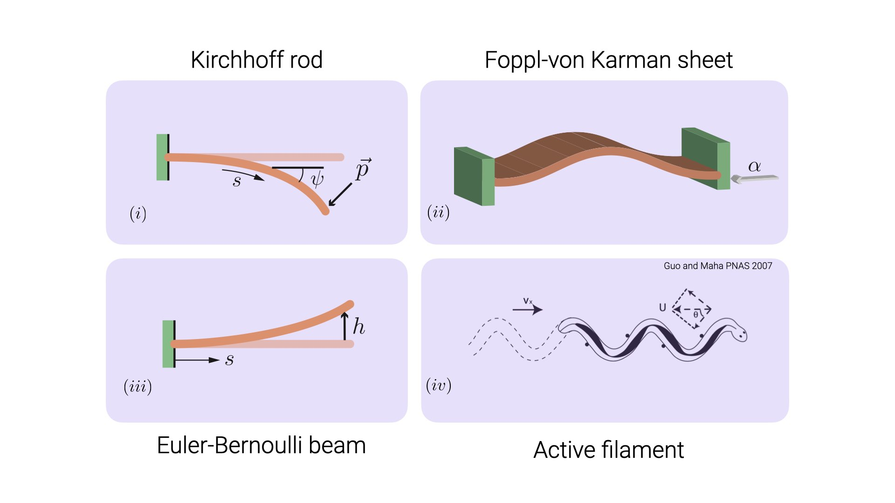

# Elastic instabilities using `auto-07p` - A tutorial series

Elastic materials are characterised by their ability to undergo local dilation, shear and twist under externally applied load and relax to a neutral configuration when the load is removed. Often when the applied load exceeds a critical value these materials undergo instabilities characterized by a smooth or dramatic change in their morphology. These instabilities are captured by identifying the forces at play and deriving governing equations for the deformation of the
material. The deformation field in the material is then related to the internal stress through a constituent relation, Hooke's law being a famous one. These elastic instability problems, as we shall see, are boundary value problems which are notorious to solve even numerically (analytical solutions are available only in isolated instances).

In this set of 4 tutorials we will see how to solve for the deformation field of the material under various active and passive forces and capture the instabilities using [`auto-07p`](https://github.com/auto-07p/auto-07p),
a numerical continuation package. The purpose of this tutorial really is to introduce you to the power of `auto-07p` to approach these problems. Though the documentation is a very good place to start, I realized during my learning process that there are a few important technical gaps that are often not discussed if one were to go from the documentation to implementation.

We begin by introducing the framework [here](./autoFw.html). Please click this link and go over it before you start reading the tutorial problems. The relevant codes used in these tutorials are available [here](https://github.com/sgangaprasath/autoTutorial). The problems we will be looking at (and the focus of each example in `auto-07p` implementation) are

* [Bending of an *elastica*](https://sgangaprasath.github.io/elastica.html) - bifurcation diagram, solution

* [Buckling of a sheet](https://sgangaprasath.github.io/fvk.html) - two parameter continuation

* Oscillating beam - eigen-value problem, homotopy continuation

* Undulatory locomotion on land - periodic solution, homotopy continuation

